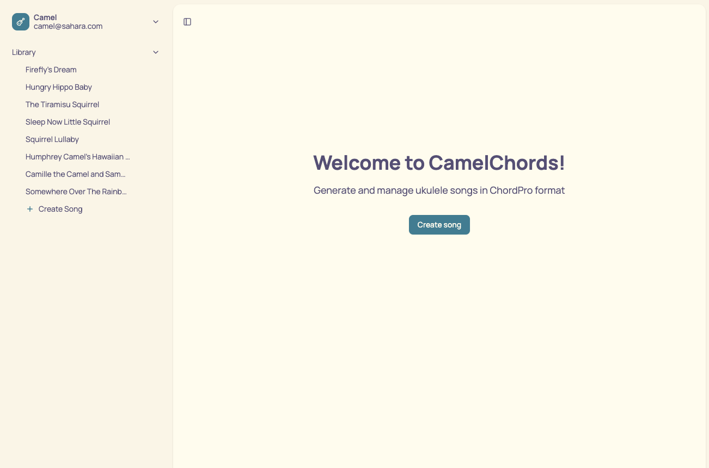
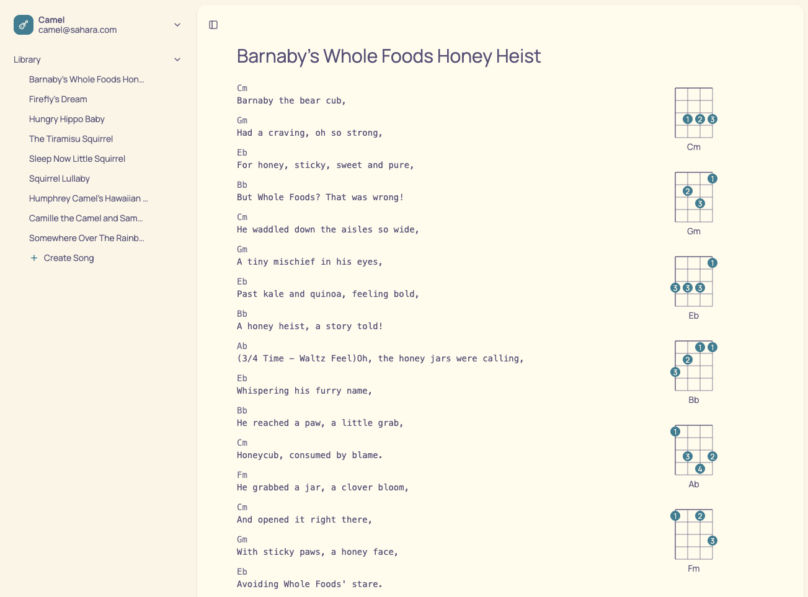
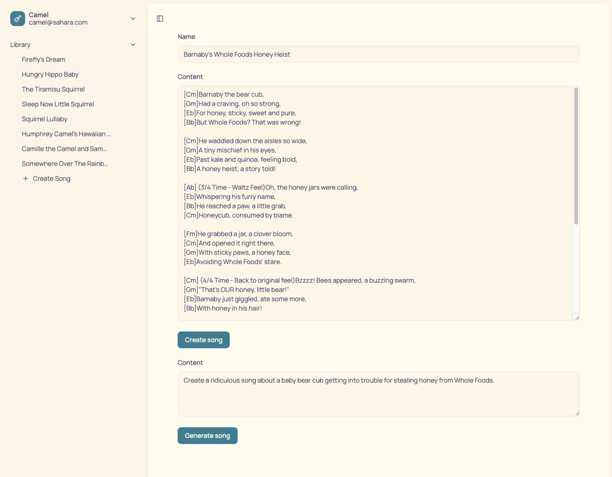

# CamelChords

Ukulele chord and lyric manager. I use this to make silly songs for my newborn.

Generates ukulele songs in ChordPro format.

Displays chord diagrams.

Based on https://github.com/nextjs/saas-starter







## Local Usage

Create `.env`.

Start Postgres in Docker, and ensure the user from `.env` exists.

```sh
pnpm install
pnpm run db:setup
pnpm run db:migrate
pnpm run db:seed
pnpm dev
```

## Environment Variables

- `POSTGRES_URL` — Your Postgres connection string
- `BASE_URL` — Base URL for the app (default: `http://localhost:3000`)
- `AUTH_SECRET` — Secret for authentication
- `GEMINI_API_KEY` — For generating songs
